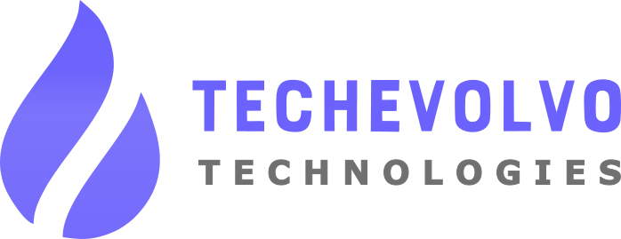

# Welcome to Techevolvo Technologies - Tech Evolution Hub! 🚀

At Techevolvo, we embrace the ever-evolving landscape of technology, positioning ourselves as your strategic partner in navigating the complexities of the digital era. 

Established with a passion for innovation and a commitment to excellence, we bring forth a powerhouse of expertise to propel your business forward. 

Our journey is marked by a relentless pursuit of technological advancements, and we stand ready to empower your organization in achieving new heights of success through cutting-edge solutions.

## Our Vision

To be the catalyst for global technological evolution, driving positive change through innovative solutions that empower businesses and enrich lives.

## Our Mission

Techevolvo is dedicated to providing unparalleled technology consulting services. We strive to understand and anticipate the evolving needs of our clients, delivering transformative solutions that enhance efficiency, foster growth, and ensure a sustainable future. 

Our mission is to be the trusted partner that propels businesses into the next frontier of technology, making a lasting impact on industries and communities worldwide.

## Our Philosophy

At the core of Techevolvo's philosophy is the belief that technology should not merely adapt to businesses but should be a driving force in shaping their future.

## Why Choose Us?

- **Innovation as a Constant:** Embrace innovation as a perpetual journey, driving our commitment to exploring and integrating the latest technological advancements into our solutions.

- **Client-Centric Approach:** Our clients are at the heart of everything we do. We listen, understand, and collaborate closely to deliver bespoke solutions that address their unique challenges and aspirations.

- **Ethical and Sustainable Solutions:** We are committed to ethical business practices and sustainable technological solutions that contribute positively to both our clients and the broader global community.

- **Continuous Learning:** Foster an environment that encourages continuous learning and development, ensuring our team remains at the forefront of emerging technologies and industry best practices.

- **Agility and Adaptability:** Embrace agility and adaptability as key drivers of success in a dynamic business landscape, responding swiftly to changes and opportunities.

## Get in Touch

Explore our [full service catalog](https://techevolvo.com/service/) to discover more!

- 🌐 Visit our [website](https://techevolvo.com) for more information.
- 📧 Contact us at info@techevolvo.com
- 📱 Follow us on [Twitter](https://twitter.com/techevolvo) and [LinkedIn](https://www.linkedin.com/company/techevolvo) for updates and insights.

Let's code the future together! 💻✨
